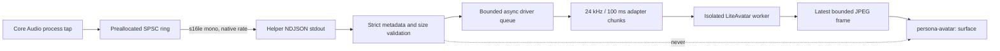

# Avatar Driver v1, LiteAvatar Gate B, and S4b

Avatar Driver v1 separates voice inputs from a particular visual renderer. The
default remains the existing VRM renderer. The experimental `liteavatar` path
can carry assistant-output PCM to an isolated OpenAvatarChat/LiteAvatar worker
and render its local JPEG frames. VRM remains visible until the first realistic
frame has decoded and returns automatically if the worker starts, restarts,
times out, or fails.

## v1 contract

Every driver accepts the same bounded semantic event set:

| Event | Required data | Meaning |
| --- | --- | --- |
| `state` | Voice phase, activity, and mute flags | Coarse lifecycle such as listening, thinking, or speaking |
| `audio-level` | Normalized finite value from `0` to `1` | Low-cost lip and body response |
| `animation` | A system or configured semantic action | One-shot or state-specific motion |

The main process owns the driver host. It validates these events, publishes a
capability/status snapshot, and is the only place allowed to receive optional
PCM. The renderer-facing preload contract is unchanged: it receives semantic
events and asset URLs, never PCM.

Driver selection is deliberately not persisted in Settings v1. A typo or an
unknown driver ID falls back to `vrm` instead of preventing Persona from
starting.

| Driver ID | Surface today | Raw PCM | Stability |
| --- | --- | --- | --- |
| `vrm` | Current transparent Three.js/VRM surface | No | Default |
| `realistic-pcm-spike` | Current VRM surface as fallback | macOS assistant output, in memory | Experimental and explicit opt-in |
| `liteavatar` | Local realistic JPEG surface with automatic VRM fallback | macOS assistant output, in memory | Experimental and explicit opt-in |
| `s4b` | Pre-rendered local state videos with decoded-frame fallback | No | Experimental and explicit opt-in |

The active driver and counters are visible through the MCP `get_status` tool.
The snapshot contains capabilities, event counts, queue depth, bytes, drops,
and errors, but no samples or media paths.

## Run LiteAvatar

Persona does not vendor the roughly 2.5 GB Python/OpenAvatarChat runtime or its
model data. Point it at an existing `avatar-spike` runtime containing
`.venv-avatar`, `vendor/OpenAvatarChat`, `model_1.onnx`, and the selected avatar
data. On this development machine the referenced project is discovered
automatically; an explicit path is preferable elsewhere.

```bash
npm run native:build
PERSONA_AVATAR_DRIVER=liteavatar \
PERSONA_LITEAVATAR_RUNTIME=/path/to/avatar-spike \
PERSONA_DEBUG=1 npm start
```

For this workspace, where the referenced runtime is auto-discovered:

```bash
npm run dogfood:liteavatar
```

The model loads in the background. The VRM remains usable during that load and
is replaced only after Chromium decodes a valid local frame. With the default
driver, the native helper does not emit PCM and the app follows the pre-Gate-B
VRM path. `--emit-pcm` is passed to the macOS helper only when an experimental
PCM driver requests it. Windows and Linux behavior is unchanged.

The worker uses ONNX Runtime CPU execution with two threads and the Torch
decoder on Apple Metal (`mps`). `use_gpu=true` is intentionally not passed:
that would select an unavailable CUDA ONNX provider rather than Metal.

## Run S4b

S4b keeps one pre-rendered speaking surface mounted, holds its own neutral frame
while silent, and does not request PCM or start a model worker. The v1 pack
schema still carries four compatibility entries. Prepare the development pack
once, run its real Electron gate, then launch it manually:

```bash
npm run s4b:prepare
npm run test:s4b:electron
npm run dogfood:s4b
```

The pack remains outside the repository and release bundle. Pack structure,
custom-person creation, alpha-video guidance, and measured transition timing
are documented in [S4B.md](S4B.md).

## PCM data plane



The helper emits PCM messages only in opt-in mode:

```json
{
  "type": "pcm",
  "encoding": "s16le",
  "sampleRate": 48000,
  "channels": 1,
  "frames": 512,
  "sequence": 42,
  "data": "<base64>"
}
```

The real-time callback mixes tapped channels to mono and writes into a fixed,
preallocated single-producer/single-consumer ring. It never locks, allocates,
serializes JSON, writes to stdout, waits for the avatar, or performs network
I/O. The non-real-time meter loop drains and serializes the ring. If it falls
behind, the helper reports `pcm-overflow` and drops avatar input without
affecting playback.

Electron accepts only mono `s16le`, sample rates from 8–192 kHz, safe sequence
numbers, canonical base64, and at most 16 KiB per message. Valid frames enter a
second queue capped at 24 chunks and 256 KiB including the in-flight frame.
When the adapter is slow, queued stale audio is discarded first so
the avatar catches up to current speech. Adapter errors are counted and
contained.

PCM remains process-local and in memory. Persona does not write it to disk,
send it over MCP/HTTP, expose it to preload, or include it in diagnostics. This
is an internal adapter seam, not a new public audio API.

## Options and trade-offs

| Direction | Strength | Main cost / risk | Fit after this spike |
| --- | --- | --- | --- |
| Keep VRM | Lowest latency and resource use; transparent 3D surface and VRMA already work | Stylized rather than photorealistic | Remains the reliable default and fallback |
| LiteAvatar sidecar | Reuses the referenced project's audio-driven worker pattern and can stay fully local | Python/model runtime, CPU/GPU and memory budget, licensing, crash isolation, and frame transport | Preferred first adapter candidate; consume the PCM sink without changing Voice |
| S4b state videos | Starts and switches quickly, has idle motion, no model runtime, and can use authored alpha | Generic speaking motion does not track phonemes; each identity needs four offline clips | Lightweight realistic option when responsiveness and desktop presence matter more than exact visemes |
| Other local talking-head pipeline | Freedom to optimize quality, identity, or Apple-silicon runtime | More glue for audio preprocessing, lifecycle, alpha/video output, and packaging | Compare behind the same driver contract; no listener fork needed |
| Hosted streaming avatar | Fastest route to polished output and vendor-managed models | Network latency, recurring cost, credentials, privacy, and loss of offline behavior | Compatible only as an explicit separate driver, not the local default |

The architectural choice is therefore reversible: validate LiteAvatar first,
but keep state/events, PCM transport, adapter lifecycle, and surface output as
separate boundaries. A different local or hosted engine replaces the adapter,
not the voice listener or MCP integration.

## Gate B verification (2026-08-02)

The automated real-model run used the referenced 16 kHz mono WAV through the
same Avatar Driver queue used by live macOS PCM. It produced an idle frame and
audio-tagged speech frames, fetched the latest JPEG through the custom protocol,
and then launched the actual Electron app to verify Chromium decoding and the
VRM-to-realistic surface switch.

| Check | Result |
| --- | --- |
| Model ready | 16.5 s first run; 6.6 s warm-cache repeat |
| Input / audio-driven frames | 5.55 s / 83–142 speech frames |
| Distinct speech images | 142 in the repeat run |
| Steady heartbeat | 20.6–20.7 fps |
| Frame interval p95 | 141 ms first run; 50 ms repeat |
| First audio-tagged frame | 2.144 s first run; 487 ms repeat |
| Worker RSS / swap delta | 1,577–2,408 MB / no positive swap growth |
| Electron PCM queue | 0 drops, 0 failures |
| Renderer | Double-buffered JPEG decoded and painted at 448×960; VRM canvas removed after first load; nonblank screenshot gate passed |

The variable 0.5–2.1 s first-frame delay is the main current trade-off. Persona passively
observes audio already playing in another app, so it cannot hold that audio and
replay LiteAvatar's aligned stream as the referenced end-to-end voice pipeline
does. Gate B therefore proves a functional local talking-head data path, not
production-grade audiovisual synchronization.

Remaining release work is deliberately manual: run a real ChatGPT/Codex voice
session with System Audio Recording permission, judge the perceptual delay,
and repeat the existing cold-start/reconnect regression. The runtime is still
an external development dependency and is not ready for redistributable app
packaging.
